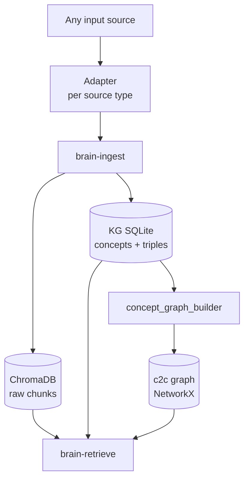
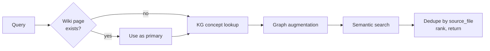

# MindGraph — How It Works, and What It Taught Us

## What it is

MindGraph turns unstructured personal input into something an agent can retrieve against, with no manual filing. Notes, call transcripts, past conversations, pasted articles — all of it goes in freeform and comes back organised by concepts the system worked out for itself.

The claim is narrow and worth stating precisely: no folder taxonomy, no tags, and cross-domain connections that emerge rather than get declared. Two notes from unrelated domains end up linked if and only if they express the same underlying concept.

As a reference deployment, current scale:

| Store | Contents |
|---|---|
| ChromaDB (`mempalace_drawers`) | 37,600 text chunks |
| Knowledge graph (SQLite) | 150,471 triples across 7,050 concepts (as of this table's date) |
| Concept-to-concept graph | 7,031 nodes, 3.32M weighted edges |

Figures verified 2026-09-19. Worth noting that the system's own reference docs had these at 108k triples and 1,133 concepts — the corpus outgrew its documentation by roughly 40% without anyone noticing, which is its own small lesson.

**It is built on MemPalace, not from scratch.** [MemPalace](https://github.com/mempalace/mempalace) (MIT, currently v3.1.0) is an existing open-source memory store — the ChromaDB collection, the SQLite knowledge graph, the wing/room addressing and the MCP server all come from it, and it runs as an installed package that we never modify. Everything described here is an *extension* of that: concept nodes and `expresses` triples added to the existing KG schema, plus skills and scripts around it. The deliberate decision at design time was to add no new database. That choice is doing more work than any other in this document — it is the reason a system this size has a maintenance cost one person can absorb.

It is packaged as a public Claude Code plugin (`github.com/derrickkwa/mindgraph`). This writeup is about the running system, not the packaging.

**What this is.** A personal project, and a write-up of its methods and lessons rather than its code. The second half is the expensive part: what broke, what held up, and where the system's limits are.

## The architecture

Two sources of truth and a derived graph. Nothing else is authoritative.

**ChromaDB holds the text.** Chunks of roughly 300–500 tokens, with wing, room, `source_file` and `filed_at` on each. Semantic search runs here.

**The knowledge graph holds the meaning.** Two SQLite tables. `entities` are concept nodes; `triples` link a source file to a concept with the predicate `expresses`, carrying a wing, validity dates and a confidence score. Bitemporal — nothing is deleted, `valid_to` is set instead.

**The c2c graph is derived and disposable.** Concepts become nodes, co-occurrence becomes weighted edges, and a rebuild produces communities, bridge nodes and going-cold metadata. It can be thrown away and rebuilt from the KG at any time, which is why it is safe to experiment on.

**The wiki is the second derived artefact.** Markdown pages synthesised from the graph, sitting between the stores and the reader. Covered in its own section below, because it is the piece that most often gets built in the wrong order.

**The one rule that shapes everything:** the link count on a concept is the signal. A concept with 200 links is well-evidenced; one with two links is probably noise. There is no curation step and no human judgment about what matters — importance is a consequence of how often something recurs across independent inputs. That single decision is what removes the maintenance burden that kills most personal knowledge systems.

**And the measured limit on that rule, found 2026-09-19.** Synthesising the graph's largest concept showed that a meaningful share of its sources are tagged on thin grounds — incidental mentions and boilerplate. The highest-degree nodes attract loose attachment, so link count is an upper bound on relevance rather than a measure of it. The rule still holds for ranking; it does not hold for reading a single number as evidence.

## The write path — where the intelligence goes

All the expensive work happens on ingest, once per record. This is the single most consequential design decision in the system.

1. **Adapter** normalises the source into JSON chunks. One adapter per source type — markdown, Obsidian, Notion, Apple Notes — and everything downstream is identical. Adapters emit provisional `wing=inbox` chunks with a namespaced `source_file` (`type:id`); they do not decide where anything belongs.
2. **Chunk** at roughly 400 tokens with 200 characters of overlap.
3. **Write to ChromaDB**, one drawer per chunk. IDs follow `drawer_{wing}_{room}_{md5hash[:16]}`, which matters later.
4. **Fetch the existing concept vocabulary** from the KG.
5. **Extract concepts** — batches of 8–16 chunks sent to Gemini Flash along with the current vocabulary, returning matched concepts, new concepts, and a confidence per concept.
6. **Write** concept entities and `expresses` triples back to the KG.

**The deduplication loop is the part that makes it work.** Every extraction call asks, in effect, "does this new concept already exist as something we have?" The vocabulary grows across batches within a run, so later batches see more and match rather than invent. Without this, concept vocabularies proliferate into thousands of near-synonyms and the graph becomes meaningless — `retry-policy`, `retry policy`, `backoff`, and `retrying failed calls` as four unrelated nodes.

**Confidence is per-concept and it is honest.** Matched concepts with clear fit score ≥ 0.85, loose fits 0.6–0.84, new speculative concepts below 0.7. Triples written before scoring existed carry `confidence = 1.0` and are explicitly treated as unscored legacy rather than as certain. That distinction cost nothing to build and has repeatedly stopped us reading old data as stronger than it is.

**Wings and rooms are concept-derived, not folder-routed.** One LLM pass proposes a nested tree, a human confirms it, then assignment is deterministic concept-overlap. The taxonomy follows the corpus instead of the corpus being forced into a taxonomy.

## The wiki layer — synthesis as a cache

Retrieval over 37,600 chunks returns evidence, not understanding. Ask what the notes say about a topic and you get ten passages that each mention it, and the job of working out what they collectively amount to falls to whoever is reading. If that question gets asked repeatedly — and the ones worth asking always do — the synthesis is being redone from scratch every time.

The wiki is that synthesis, written down once. Plain markdown files in `_wiki/`, currently 23 concept pages, following the Karpathy pattern of an LLM-maintained document tree.

**When a page gets written.** On demand, never proactively. The design has two triggers: someone asks for one, or a lint pass flags a concept with 20 or more links and no page. That threshold is the whole editorial policy — a concept the corpus keeps returning to has earned a page, and nothing else has.

**For five months only the first trigger fired.** The lint pass was specified as a weekly cadence and never scheduled; it had been run once, in May 2026. So the wiki grew when someone thought to grow it, which is why it sat at 22 pages against 7,050 concepts. The threshold was sound and the automation around it did not exist.

**Fixed 2026-09-19.** The lint now runs on a weekly schedule, after the two ingest jobs so it reads fresh data. Its first full pass surfaced 20 concepts with 20+ links and no page, 50 duplicate-name candidates, and 2,392 noise concepts under three links — a third of the vocabulary. The first of those gaps has since been written, which is the 23rd page.

**How one gets written.** `brain-synthesize` resolves the concept to its KG node, collects every source file expressing it, pulls up to 60 chunks deliberately spread across wings rather than taking the top 60 by similarity, and writes a structured page: what the concept is, patterns observed, examples from notes, cross-domain appearances, related concepts, open questions. The cross-wing spread is the point — it is what makes a page about one domain cite a note from another when the underlying principle is the same.

**Where it lands.** Routed by the concept's dominant wing into a matching folder under `_wiki/`, and anything genuinely mixed to `_wiki/cross-domain/`. The index and a change log update alongside.

**Why it sits first in the read path.** A page distilled from 60 chunks across four wings beats ten chunks retrieved by cosine similarity, and it costs nothing at read time because the expensive part already happened. Same principle as the write path, applied one level up.

**What it deliberately does not do.** A page carries a synthesis date and goes stale. It is wrong for anything current — a specific source's recent notes, a decision made last week, or any question where the individual source matters for attribution. Those go to search, which is why the read path falls through to it rather than stopping at the wiki.

## The read path — deliberately dumb

Retrieval is deterministic Python. No model decides what to fetch, and no model ranks the results.

The ordering is the whole design. Synthesised wiki pages win over raw results, because a page distilled from 60 chunks across four wings beats ten chunks retrieved by cosine similarity. Then the concept graph, which finds notes that never use the query's words. Then semantic search as the backstop. Results deduplicate by `source_file` and rank wiki > KG+semantic > semantic-only > KG-only.

**Graph augmentation is the part that does something search cannot.** A single call returns four things alongside the ordinary results:

| Signal | What it surfaces |
|---|---|
| God nodes | The highest-degree concept in a community — what is load-bearing here |
| Bridge nodes | Concepts appearing in 3+ distinct wings — genuinely cross-domain principles |
| Surprising neighbours | Strongly-linked concepts in a *different* community |
| Recency | Last seen, days ago, and whether the concept is active, going cold or stale |

Surprising neighbours is the one that earns its keep. It is explicitly looking for a strong edge that crosses a community boundary, which is the closest thing the system has to an idea it did not already have.

**Two retrieval speeds.** A pulse is one search call, fired reflexively on almost any substantive topic. A full retrieve runs the whole pipeline. The default is pulse, because a system that is expensive to consult stops being consulted — which is a usage finding, not an engineering one, and it took a while to admit.

## FORK — counter-pressure on your own notes

A personal note store is curated by resonance. You write down what struck you, which means what struck you is what comes back. Retrieval over that corpus does not tell you what is true; it tells you what you already believed, with citations. Left alone, the system becomes a machine for producing confident agreement with yourself.

FORK, built July 2026, is the correction. It runs automatically on every retrieval.

1. **A cheap Python dispersion score** (`consensus_gate.py`, threshold 0.55) measures how tightly the retrieved sources cluster. If they are spread, nothing happens — no model call, no cost.
2. **If they are tight, a stance read.** Do these notes share a *position*, or merely a topic? Most of the time it is merely a topic, and the check stops there.
3. **If they genuinely share a stance, one line of steelman** — the strongest case against — explicitly labelled as not coming from the notes.
4. **A belief ledger records it.** Each belief carries one of five states: untested → leaning → solid, or shaky, or flipped. A 30-day cooldown stops the same belief being challenged repeatedly.

The constraint that makes the ledger mean something: **a belief can only reach `solid` by surviving a real external source that was ingested**, never by surviving a steelman the system generated itself. Otherwise the loop closes and confidence becomes self-manufactured.

It also answers two questions nothing else in the system could: *what have I changed my mind about* (`--list flipped`) and *what do I hold strongly but have never tested* (`--list untested`). The second list is uncomfortable and that is the point.

**Since 23 September the ledger is an append-only event log** (`<data home>/beliefs/ledger.jsonl`). Nothing is edited or deleted; current state is a fold over the events, and `--history <key>` replays how a belief changed. It now also holds superseded verdicts from other memory sources, so *what have I changed my mind about* covers working conclusions, not only notes.

## Lessons

Each of these cost something. Ordered by how much.

**Put the model on the write path and keep the read path deterministic.** This is the finding everything else follows from. Extraction, entity resolution and deduplication are LLM work done once per record. Retrieval, ranking, precedence and staleness are Python, done every time, the same way. Published research points the same way (figures from the paper, not measured here): one architectural study found that adding LLM calls at mutation time added 22.6 to 24.1 points on the 345 of its 385 cases that the change affects, against a deterministic baseline; about $0.17 for a full 385-case run ([Control-Plane Placement Shapes Forgetting](https://arxiv.org/abs/2606.15903)).

**Agents cannot compare metadata across records, and will not tell you they failed.** MindGraph keeps every recency and ranking decision in Python for this reason. Published work quantifies it (figures from the paper, not measured here): asking a model to find the newest version of a record directly fell from 75% to 61% accuracy between 64K and 262K tokens of context, while having the model extract candidates and code pick the winner held at 93% with gpt-4o at 262K ([Reliable Post-Retrieval Assembly for Agent Memory](https://arxiv.org/abs/2606.01435)). Any arithmetic, ranking or recency comparison left to the agent is a silent defect.

**Don't build the knowledge graph first — and possibly don't build it at all.** The evidence for graphs is thinner than it looks (figures from the paper, not measured here): in Zep's own paper, on its Deep Memory Retrieval benchmark, the temporal knowledge graph scored 94.8% against 94.4% for simply passing the full conversation, and with a weaker reading model (gpt-4o-mini) it fell below full context on knowledge-update questions, 74.4% against 76.9% ([Zep](https://arxiv.org/abs/2501.13956)). A separate evaluation across several agent-memory architectures found graph-heavy systems running at roughly 32–42x the latency for under 2x the utility gain, a ratio that should make anyone reaching for a graph pause first (figures from the paper, not measured here) ([Are We Ready For An Agent-Native Memory System?, Fig. 11](https://arxiv.org/abs/2606.24775)). We built one, and it earns its keep here because the corpus is genuinely cross-domain, but the honest read is that the c2c layer — co-occurrence plus community detection — delivers most of the value for a fraction of the complexity.

**Don't let an agent decide what to remember.** Writes are pipeline-decided. The model is used for extraction, never for curation — a curating agent makes the store depend on what it happened to judge important, which is the thing link count exists to avoid.

**Link count beats curation, and it removes the maintenance burden entirely.** Letting importance emerge from recurrence across independent inputs is what keeps a system like this running without filing. Every personal knowledge system that requires filing eventually stops being fed.

**Your notes agree with you. Build the dissent in from day one.** Retrofitting a dissent layer after the fact means a stretch of retrieval that quietly reinforced whatever was already there before the correction existed. If the corpus is curated by any human judgment — and all of them are — a counter-pressure layer is not a nice-to-have.

**Isolate dev from prod at the environment level, or you will lose data.** A test run against the real store flipped 14,769 of 25,025 records into an inbox bucket. It was recoverable only because record IDs encode wing and room (`drawer_{wing}_{room}_{hash}`), so the true values could be parsed back out of the ID and written to metadata directly. Two things saved it: the ID carried redundant provenance, and the pipeline deduplicates by content hash, which meant re-ingestion would *not* have fixed it — the repair had to be metadata-only. There were no backups. There are now.

**Pick one identity key and normalise it in one place.** The costliest bug found so far, and the most transferable. The store mints a concept's id as `name.lower().replace(" ", "_")`, which never reconciles hyphens against spaces — so `concept name` and `concept-name` become two rows for one concept. The ingest scripts then check existence **by id** while the triples key **by name**. Same concept, two identities, and every count read through that join silently doubles.

It went undetected for three months and surfaced only because a reported figure looked wrong: 1,244 links against 623 actual. 51 of 7,090 concepts (at the time) were affected. Note the failure shape — nothing errored, no constraint was violated, and every query returned a plausible number. It is a wrong-join bug arriving from the write side. Because link count is the system's main signal, an entity-resolution bug that inflates counts is not a reporting nuisance; it changes what ranks as important.

**Benchmark results are worthless unless the embedding model is held constant.** A published example (figures from the paper, not measured here): Mem0 beat a RAG baseline by 11 points with one embedding model and lost to it by 1.2 points with another — one variable flipped the conclusion ([MemDelta](https://arxiv.org/abs/2606.29914)).

**The maintenance layer is the first thing to rot, and it rots silently.** Writing this document turned up a live example: the weekly lint was designed, built and never scheduled — it had run once in five months. That failure is invisible from outside: the system answers every query, confidently, using whatever it last managed to load. Any scheduled job needs a freshness assertion that something actually reads — a job that fails loudly is a nuisance, a job that fails quietly is a data-quality incident with an unknown start date. The lint now writes a `status.json` with `ran_at` and `ok` for exactly this reason.

**The specific trap, because it will recur:** a scheduled job can succeed or fail depending on which executable launches it, because macOS grants disk access per executable, and nothing in the error says so.

**Everything measures recall; production fails on forgetting.** Every benchmark in this field asks whether the system found the right thing. Real failures are stale facts resurfacing with confidence. Nobody ships an eval that asks whether a superseded belief *stops* appearing, and that is the eval worth having.

**The always-loaded index is a silent-failure surface too.** An assistant memory index that loads into every session can carry a hard ceiling — one such index reached roughly 25KB against a ~24.4KB limit, and its last section simply stopped loading, with no error. Compression was the wrong fix. The fix was an admission test: a line stays only if missing it would cause a wrong action and nobody would think to look it up first. Rules and gotchas pass; everything else routes through topic hubs. The index shrank by more than half and no longer grows with each new memory. See `docs/memory-index.md` for the pattern in full.

**Make conclusions searchable and stale status becomes a retrieval defect.** Putting memory-style conclusion files into the store as their own wing made them retrievable beside the notes — and made every "awaiting reply" inside them answer as if it were current. That is the forgetting failure above, arriving the moment conclusions became searchable. The fix kept only the current verdict in each file and moved superseded verdicts to the belief ledger. It also surfaced status lines that had quietly gone stale, all still reading as live. Two rules keep that wing honest: it is excluded from FORK's consensus count, so a system's own summaries of its notes never vote as extra agreement, and nothing derived from it feeds the graph or the wiki.

**The dissent layer's gate had quietly stopped firing.** A review found FORK's pulse gate receives bare file names from search (`note-title`), while the store keys the full path (`source/…/note-title`). The large majority of stored source names carry a path, so the lookup matched almost nothing and the gate almost always reported "not tight." Nothing errored. It is the identity-key lesson again, this time on the read path, and it means the counter-pressure layer described above had probably been mostly inert. Fixed in 0.3.0: the gate now takes the query itself (`--query`) and fetches the embeddings, so it never sees bare names.

**A local vector store with several writers needs one lock, and a long-running reader will still be stale.** The store can have several writers at once — a scheduled sync, a hook that re-syncs a file on edit, and the server queried at read time. The local index is per-process, and the server caches its client, so it cannot see other processes' writes until it restarts. Worse, a stale process writing back can drop vectors that still exist in the database underneath — a loss `get`-style checks cannot see. The scripts now share one write lock, and the lint queries a few chunks by their own text to confirm their ids come back. The server's own writes sit outside the lock; that risk is known, not solved.

## What held up, and what it doesn't do

**Held up well.** The write-path/read-path split, and the reasons for it. The adapter pattern — one per source, everything downstream identical — which keeps connector work, the bulk of the effort, separate from anything that differentiates the system. Bitemporal validity instead of deletion. Per-record confidence scores that distinguish unscored from certain. Provenance encoded redundantly in the record ID, which is the only reason a bad bulk operation was survivable.

**Would do differently.** Don't start with the graph. Don't let an agent curate. Don't trust an internal A/B without holding embeddings, chunking and prompt format constant. Don't let two code paths derive an entity's identity independently — one normalisation function, called everywhere, and lookups keyed on the same field the joins use. And schedule the maintenance job at the same time you write it, with a freshness field something reads.

**What it doesn't do.** MindGraph is a *recall* system: it answers "what do I know about X," and the only test of an answer is whether it was useful. It does not verify that what the notes say is true — retrieval returns what was written down, with citations. It does not decide what matters beyond link count, so a heavily-linked concept can still be loosely evidenced. It does not forget on its own: a stale note or conclusion keeps surfacing until someone marks it superseded. And the belief ledger records how a belief changed and what it survived, but it only moves when a person or a retrieval records an event — nothing in the system checks a belief against the world by itself.

Those limits are deliberate for now. MindGraph shows that the surrounding machinery — ingest, a self-organising vocabulary, retrieval, synthesis, dissent and a change history — can be built and kept running by one person at this scale.

**Still open.** The belief ledger's five states and 30-day cooldown were set as defaults to be recalibrated after real use, and they never have been. Any ledger built on this shape should argue its promotion rules rather than copy them.

A second shape problem surfaced in September. The ledger holds one current belief per key, but a memory file often carries several verdicts, so folding them under one key made `--list flipped` misleading for most entries. The working fix is a sub-key per claim. The general lesson: record one ledger entry per claim, not per document.

## Sources

Figures marked "from the paper" come from these published papers and were not measured on MindGraph. Every other number comes from MindGraph's own stores or the author's own Claude Code setup.

- [Control-Plane Placement Shapes Forgetting: An Architectural Study of Agent Memory Across Thirteen System Configurations](https://arxiv.org/abs/2606.15903)
- [Reliable Post-Retrieval Assembly for Agent Memory: Separating Evidence Extraction from Policy Execution](https://arxiv.org/abs/2606.01435)
- [Zep: A Temporal Knowledge Graph Architecture for Agent Memory](https://arxiv.org/abs/2501.13956)
- [MemDelta: Controlled Baselines and Hidden Confounds in Agent Memory Evaluation](https://arxiv.org/abs/2606.29914)
- [Are We Ready For An Agent-Native Memory System?](https://arxiv.org/abs/2606.24775)
